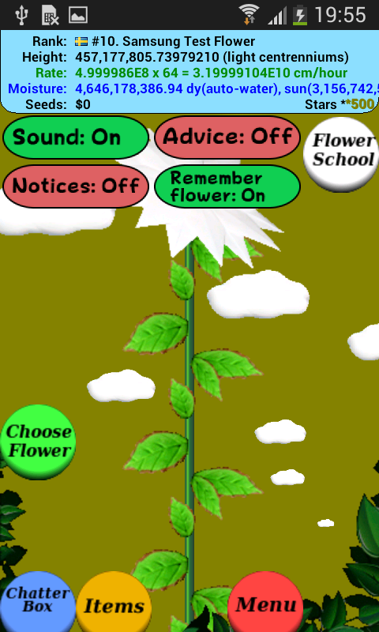
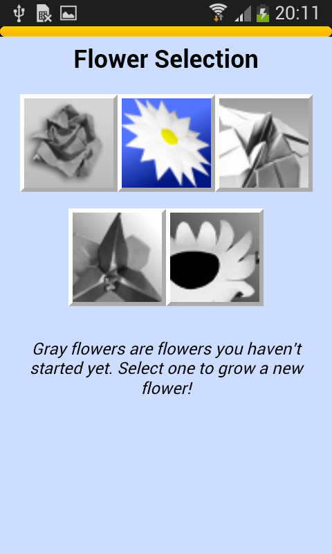
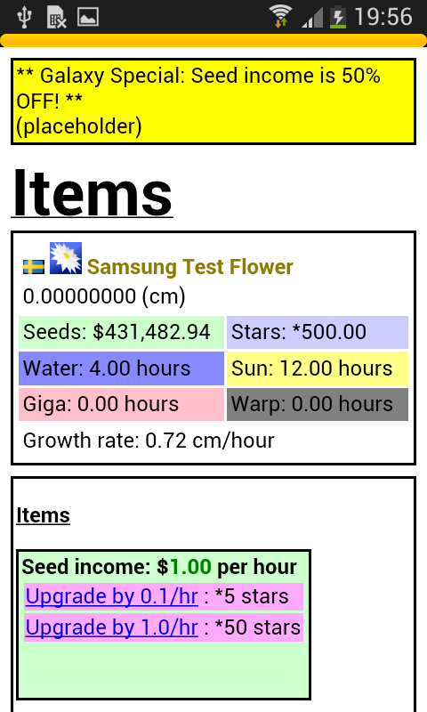
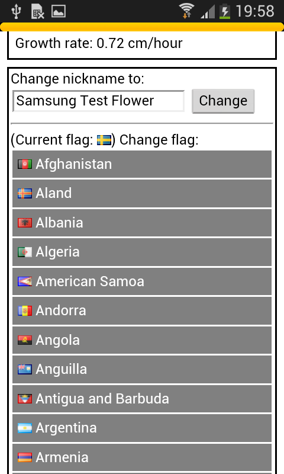
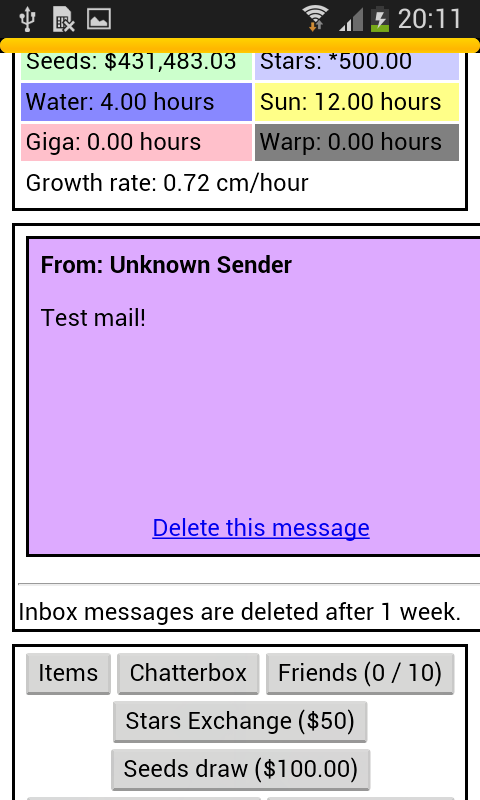
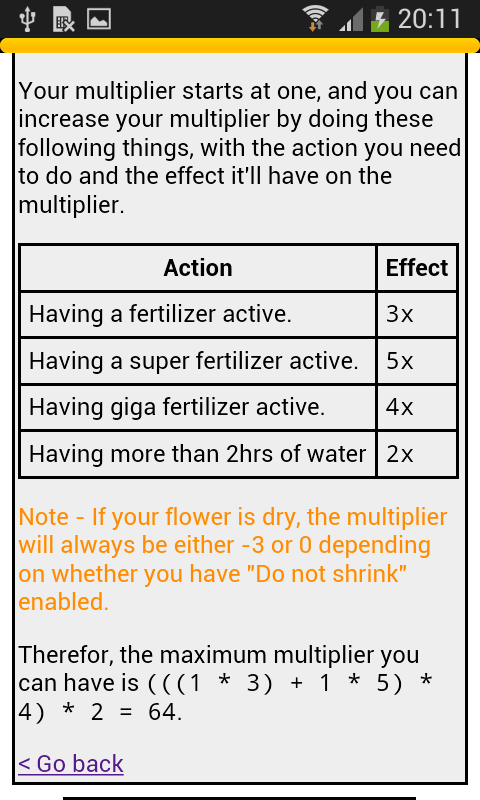
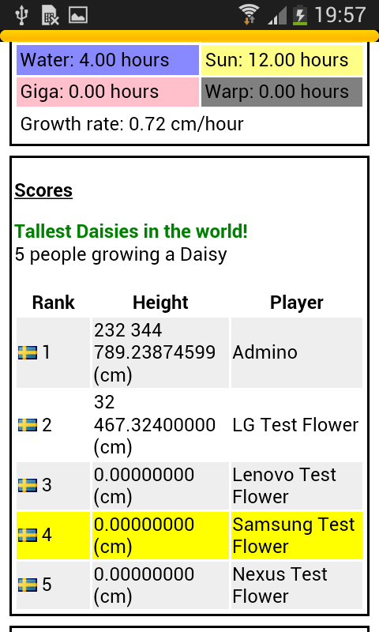
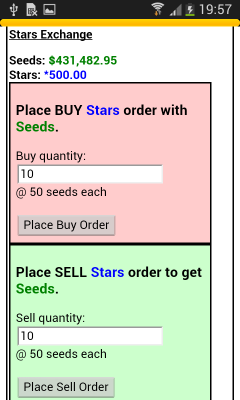

<h1 align="center">flower-web</h1>

    

Unofficial reimplementation of the server used for the Origami Flowers games.

<em>Screenshots:</em>

Origami Flowers was a series of mobile games by Adam Schmelzle that would link up together into what could be best described as a flower growing MMO. Starting out on Java ME feature phones, it was then ported to the iPhone, and later Android where it had the largest impact. The game was very popular between 2009-2013, but slowly began fading out after that point. In December of 2017 the official server for the game was shut down, making the game unplayable as it relied on the server to function.

This repository contains the source code for an unofficial reimplementation of the Origami Flowers server which I mainly developed during 2019. It never ended up going very far in terms of functionality and playability, but nonetheless it serves as an interesting throwback to the game that once was.

As far as I am aware, this is the only attempt there has been to revive the game after it was shut down in late 2017, and I am likely the only person past the shutdown of the official servers that have gotten the game to run again. I worked on the project completely in private and have basically never talked about it publicly until now when I am publishing the source repository for it. Information about the game is difficult to come by nowadays and I am not aware of any communities created by old fans of the game.

In addition to this, there are also a number of other things contained in the repository such as incomplete endpoints for interacting with other of Adam's games (e.g. Attack Breaker Pro, Public Opinion Predictor), Kaitai struct files documenting different kinds of binary formats for network requests and responses used by the game, and some more miscellaneous documentation scattered throughout.

This repository is provided as-is for archival and reference purposes. I was very young when I wrote all this and haven't touched the code in many years, so I would not recommend running it outside of a local environment. No support is provided with getting this set up, and the repository is not under any open source license at this time.

If you have any other thoughts or fun anecdotes you want to share regarding the games, feel free to [contact me](https://voxelmanip.se/contact/).
